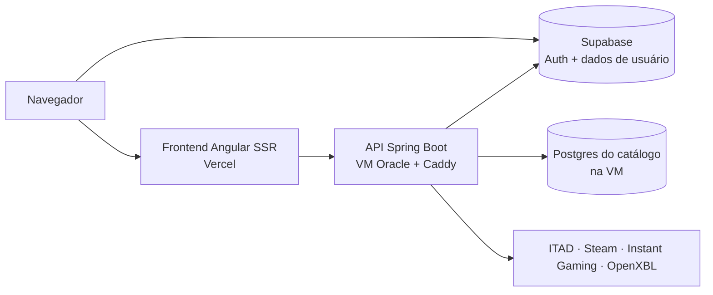

# Oferta Games

Comparador de preços de jogos para o Brasil. Junta as ofertas das principais lojas (Steam, Epic, Nuuvem, Microsoft Store, Fanatical, Instant Gaming e outras), mostra o menor preço, o histórico dos últimos 90 dias e avisa quando o preço de um jogo monitorado cai.

Também tem perfil gamer compartilhável, com biblioteca, horas jogadas e conquistas importadas da Steam e do Xbox.

Site: https://ofertagames.vercel.app

## Funcionalidades

- **Catálogo** com cerca de 190 mil jogos e DLCs, filtros (plataforma, loja, preço, desconto) e busca que entende siglas ("gta", "cod", "re 4").
- **Página do jogo** com todas as lojas, cupons, histórico de preço, detalhes, reviews da Steam e da comunidade e conquistas.
- **Home** com lançamentos em alta, promoções nos jogos mais populares, grátis da semana e maiores descontos, ordenada por um ranking de popularidade atualizado todo dia.
- **Jogos monitorados** com meta de preço e notificação no site quando o preço cai.
- **Perfil público** (`/seu-nome`) com blocos personalizáveis, biblioteca Steam e Xbox, favoritos, coleções e platinados.
- **Fale conosco** com anexo de imagem ou vídeo e resposta entregue nas notificações.
- **Painel de administração** com moderação de perfis, mensagens, erros registrados e status das coletas.

## Arquitetura



| Parte | Tecnologia | Onde roda |
|---|---|---|
| Frontend | Angular 21 com SSR (zoneless) | Vercel |
| API | Java 21, Spring Boot 3.3 | VM Oracle, Docker Compose + Caddy (HTTPS) |
| Autenticação e dados de usuário | Supabase (Auth, Postgres, Storage) | Supabase, região São Paulo |
| Catálogo (jogos, ofertas, histórico, conquistas) | PostgreSQL 17 | Container na mesma VM da API |
| Fontes de preço e dados | ITAD (preços), Steam (metadados, conquistas, listas), Instant Gaming (scraping permitido pelo robots.txt), OpenXBL (Xbox) | — |

As coletas rodam dentro da própria API, agendadas: preços a cada 10 minutos, metadados e detalhes da Steam, conquistas, descoberta de jogos novos a cada 3 horas e ranking de popularidade uma vez por dia. Uma trava no banco garante que só uma coleta rode por vez.

## Estrutura do repositório

```
frontend/          Angular (páginas em src/app/pages, serviços em src/app/services)
backend-java/      Spring Boot (código em português: Controlador*, Servico*, Repositorio*)
  sql/             Migrations do Supabase e do catálogo, aplicadas manualmente, em ordem de data
deploy/oracle/     compose.yml, Caddyfile, script de backup e guia de restauração
supabase/          Templates de e-mail do Supabase Auth
.github/workflows/ CI, deploy do backend e monitoramento de hora em hora
doc.md             Documentação técnica completa: decisões, regras de negócio e histórico
```

## Rodando localmente

Requisitos: Node 22+, Java 21 e Maven.

### Frontend

```bash
cd frontend
npm install --legacy-peer-deps
npm start
```

O `--legacy-peer-deps` é necessário (a CI usa o mesmo); sem ele o npm acusa conflito de dependências entre pacotes do Angular. Abre em `http://localhost:4200`. A URL da API fica em `src/app/configuracao/url-api.ts` e aponta pra produção; pra usar uma API local, troque por `http://localhost:8080/api` sem commitar.

Outros comandos: `npm test` (testes unitários), `npm run build` (build de produção com SSR).

### Backend

Crie as variáveis de ambiente (lista abaixo) e rode:

```bash
cd backend-java
mvn spring-boot:run
```

A API sobe em `http://localhost:8080`. As coletas agendadas ficam **desligadas** por padrão (`APP_SYNC_SCHEDULER_ENABLED=false`), pra ninguém disparar chamadas às APIs externas sem querer.

Testes: `mvn test`.

### Variáveis de ambiente do backend

Nunca versione os valores. Em produção eles ficam só no `.env` da VM (modelo em `deploy/oracle/.env.example`) e nos segredos do GitHub Actions.

| Variável | Para quê |
|---|---|
| `DATABASE_URL` | Postgres do Supabase (dados de usuário). Aceita o formato do pooler. |
| `CATALOG_DATABASE_URL` | Postgres do catálogo. |
| `SUPABASE_URL`, `SUPABASE_ANON_KEY` | Validar o token de login dos usuários. |
| `ITAD_API_KEY` | Preços e dados da IsThereAnyDeal. |
| `STEAM_WEB_API_KEY` | Conquistas e biblioteca da Steam. |
| `XBL_APP_KEY` | Integração com Xbox via OpenXBL. |
| `SYNC_SECRET_KEY` | Protege os disparos manuais de sincronização. |
| `ADMIN_USER_IDS` | IDs de usuário com acesso ao painel `/admin`. |
| `SSR_API_TOKEN` | Identifica as chamadas do SSR da Vercel (mesmo valor configurado na Vercel). |
| `CORS_ALLOWED_ORIGINS` | Origens permitidas (site e `http://localhost:4200`). |
| `FRONTEND_URL`, `PUBLIC_BACKEND_URL` | Links gerados pela API (sitemap, retorno do login da Steam). |
| `APP_SYNC_SCHEDULER_ENABLED` | Liga as coletas agendadas (só em produção). |
| `CONTATO_ANEXOS_DIR` | Pasta dos anexos do Fale conosco. |

## Deploy

- **Frontend:** a Vercel publica sozinha a cada push na `master`.
- **Backend:** cada push roda a CI (`ci.yml`: testes do backend, testes e build do frontend). Se ela passar, `deploy-oracle.yml` atualiza a VM por SSH e só reconstrói o container quando há mudança no backend.
- **Banco:** as migrations em `backend-java/sql/` são aplicadas à mão, na ordem das datas.
- **Monitoramento:** `monitoramento.yml` confere de hora em hora o site, a API, o disco, a memória, os containers e os backups. Se algo falhar, abre uma issue com a etiqueta `alerta`, que fecha sozinha quando tudo volta ao normal.
- **Backup:** diário, dos dois bancos, pelo `deploy/oracle/backup.sh`. Restauração explicada em `deploy/oracle/README-catalogo-db.md`.

## Convenções

- Código do backend em português (`ServicoCatalogo`, `RepositorioJogos`); nomes de APIs externas e campos JSON ficam como no original.
- Tabela nova com dado de usuário precisa de `ON DELETE CASCADE` pra `auth.users` ou entrar na lista de exclusão manual da conta (ver `doc.md`, seção "Preparacao pro lancamento").
- Sincronizações nunca apagam e regravam dado de usuário; sempre fazem upsert.
- Toda mudança de comportamento atualiza o `doc.md` no mesmo commit.

## Documentação

- [`doc.md`](doc.md): referência técnica completa (arquitetura, coletas, regras de catálogo, API, segurança, estado atual e próximos passos).
- [`deploy/oracle/README-catalogo-db.md`](deploy/oracle/README-catalogo-db.md): banco do catálogo, backups e restauração.
- [`supabase/email-templates/README.md`](supabase/email-templates/README.md): como aplicar os templates de e-mail.
- [`backend-java/README.md`](backend-java/README.md): notas do backend.
